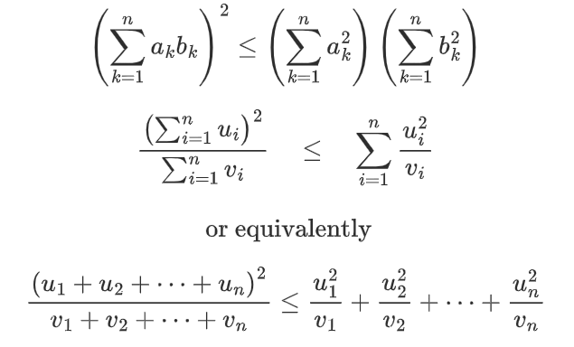

<h1 align="center">Hi 👋, I am Osvaldo Martini</h1>
<h3 align="center">A passionate FullStack Developer</h3>

  

- 🔭 I am currently working as a Freelancer **Open to opportunities**

- 🌱 I'm currently delving into **React Js | React Native**

- 💬 Ask me about my Skills **React Js, React Native, JavaScript, Python **

- 📫 How to contact me: **osvaldo.martini@gmail.com**

- ⚡ Curiosities **Always in a good mood, I'm funny**

- ⚡ Curiosities **Always in a good mood, I'm funny**

- ⚡ Currently, I am working on a migration from Delphi Pascal (More than 60K lines of code done in 2004) for Java, Python, React, Kafka Stream, etc. 

- If you want to participate, visit the repository: [Algol](https://github.com/OsvaldoMartini/OsvaldoMartini)

- YouTube: [Random Number Map of Prediction: Past -> Present -> Future](https://youtu.be/EDn2VHgbCCY)

<!-- 
$$\left( \sum_{k=1}^n a_k b_k \right)^2 \leq \left( \sum_{k=1}^n a_k^2 \right) \left( \sum_{k=1}^n b_k^2 \right)$$

$${\frac {\left(\sum_{i=1}^{n}u_{i}\right)^{2}}{\sum_{i=1}^{n}v_{i}}}\quad \leq \quad \sum_{i=1}^{n}{\frac {u_{i}^{2}}{v_{i}}}$$

$${\text{ or equivalently}}$$

$${\frac {\left(u_{1}+u_{2}+\cdots +u_{n}\right)^{2}}{v_{1}+v_{2}+\cdots +v_{n}}}\leq {\frac {u_{1}^{2}}{v_{1}}}+{\frac {u_{2}^{2}}{v_{2}}}+\cdots +{\frac {u_{n}^{2}}{v_{n}}}$$
 -->

<h3 align="left">Connect with me:</h3>

  
<h3 align="left">Languages ​​and Tools:</h3>

